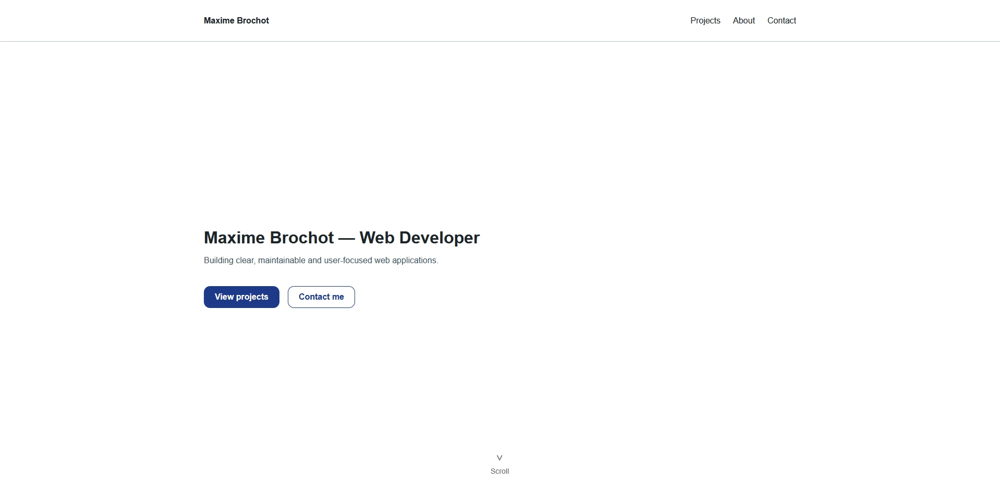

# Portfolio

> A professional developer portfolio built to demonstrate not only completed projects, but also software architecture, maintainability and modern development practices.



---

## Overview

This repository contains the source code of my personal developer portfolio.

Beyond showcasing completed projects, this portfolio has been designed as a real software project following professional development practices. It focuses on clean architecture, reusable components, accessibility, SEO and long-term maintainability.

The project is continuously improved as new projects, features and architectural decisions are added.

---

## Live Demo

The portfolio is available online:

**https://maxime-brochot.dev**

---

## Features

- Responsive design
- Detailed project case studies
- Interactive image gallery with lightbox
- Reusable UI component library
- Centralized project data
- SEO optimization
- Accessibility-focused interface
- Technical documentation
- Architecture Decision Records (ADR)

---

## Tech Stack

| Category      | Technologies        |
| ------------- | ------------------- |
| Frontend      | React, React Router |
| Styling       | SCSS                |
| Build Tool    | Vite                |
| Code Quality  | ESLint, Prettier    |
| Documentation | Markdown, ADR       |

---

## Architecture

The portfolio follows a modular and component-based architecture.

Responsibilities are clearly separated between presentation, reusable UI components, project data and styling, making the application easier to maintain and extend over time.

```text
src/
├── assets/
├── components/
├── data/
├── pages/
├── scss/
├── App.jsx
└── main.jsx

docs/
├── adr/
├── architecture.md
├── coding-conventions.md
├── design-vision.md
├── project-vision.md
├── roadmap.md
└── ui-components.md
```

---

## Documentation

The project includes dedicated technical documentation covering both development practices and architectural decisions.

- Architecture
- UI Components
- Coding Conventions
- Project Vision
- Design Vision
- Roadmap
- Architecture Decision Records (ADR)

---

## Getting Started

### Clone the repository

```bash
git clone https://github.com/BrochotMaxime/portfolio.git
cd portfolio
```

### Install dependencies

```bash
npm install
```

### Start the development server

```bash
npm run dev
```

### Create a production build

```bash
npm run build
```

### Preview the production build

```bash
npm run preview
```

---

## Lighthouse

The portfolio has been optimized for production and achieves the following Lighthouse scores:

| Category       | Score |
| -------------- | ----: |
| Performance    |    92 |
| Accessibility  |   100 |
| Best Practices |   100 |
| SEO            |   100 |

---

## Roadmap

The portfolio will continue to evolve over time.

Planned improvements include:

- Additional projects
- Continuous UI improvements
- Expanded documentation
- New technical experiments
- Ongoing performance optimization

---

## License

The source code of this project is licensed under the MIT License.

Project content, texts, images and other original assets remain © Maxime Brochot. All rights reserved.
